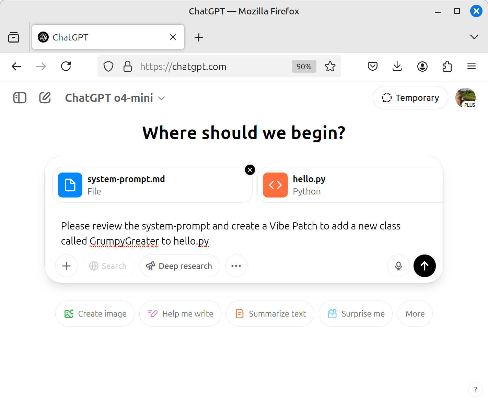
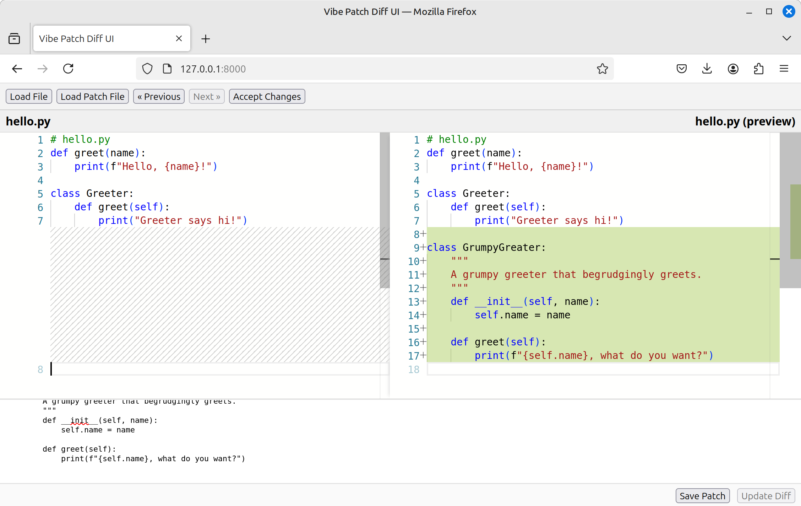

# Interactive Patching Tool

An interactive tool for applying, reviewing, and managing incremental code patches in your projects that also integrates AI-driven patch generation via conversational prompts. Leveraging the Vibe Patches specification, this tool provides a streamlined UI for generating, previewing, and committing code changes.

Coding with AI can be fun, rewarding, and profitable, but it can also be frustrating and time consuming.  This tool aims to bridge this between time, before AI takes over all programming tasks, but providing you with the tools you need to 
code in confidence knowing that you can revert any changes that break your code, as well as remove common frustrations of dealing with larger code bases when the AI becomes reluctant to provide the whole code.  This minimizes required AI output
while enabling a robust patching system that is robust to white space differences that plague the traditional patch system.

## Features

- **Apply Vibe Patches**: Seamlessly apply `add_function`, `add_method`, `add_class`, and `add_block` patches to your source files.
- **Version Navigation**: Browse through patch history with forward and backward controls.
- **Backup Originals**: Automatically back up original files before applying changes.
- **Dry-Run Mode**: Preview patches without modifying disk files.
- **Diff Viewer**: See side-by-side diffs of pending and applied changes.

## Installation

1. Clone the repository:
   ```bash
    conda create -n vibe python=3.12 -y             # [optional]
    conda activate vibe                             # [optional]
    cd ~/code/                                      # use your code directory
    git clone git@github.com:wyojustin/Vibe.git     # clone the repo
    cd Vibe                                            
   ```
2. Install dependencies:
   ```bash
    pip install -r requirements.txt                 # install reqs
   ```
3. Run tests
   ```bash
    python tests/regression_tester.py               # run the regression tests
    ✅ add_block_after_anchor
    ✅ add_block_before_anchor
    ✅ add_block_default
    ✅ add_block_end
    ✅ add_block_start
    ✅ add_class_create
    ✅ add_class_replace
    ✅ add_function_create
    ✅ add_function_replace
    ✅ add_insulter_class
    ✅ add_method_create
    ✅ add_method_replace
    ✅ multi_patch
    ✅ remove_block
    ✅ remove_class
    ✅ remove_function
    ✅ remove_method
    17/17 tests passed.
   ```
4. Copy example
   ```bash
   cp -r tests/multi_patch/ ~/tmp/example/        # save to tmp for testing
   ```
5. Start the UI:
   ```bash
    python server.py --help                         # check out the options
    python server.py --baseDir ~/tmp/example        # launch server
   ```

## Quick Start

1. Open the tool in your browser at `http://localhost:8000`.
2. Load a target file or directory. (~/tmp/example/hello.py)
3. Create or load a Vibe Patch YAML file. (~/tmp/example/multi_patch.vibe)
4. Preview the diff and click **Apply Changes**.
5. Navigate through backups using the **Previous** and **Next** buttons.

## AI-Aided Patch Creation Example

1. Upload the "Vibe/system-prompt.md" and "~/tmp/example/hello.py" In the chat prompt, ask:
   ```text
   Please review the system-prompt and create a Vibe Patch to add a new class called GrumpyGreater to hello.py
   ```
   
2. The AI returns a patch spec:
   ```yaml
   # VibeSpec: 1.5
   patch_type: add_class
   file: hello.py
   --- code: |
       class GrumpyGreater:
           """
           A grumpy greeter that begrudgingly greets.
           """
           def __init__(self, name):
               self.name = name

           def greet(self):
               print(f"{self.name}, what do you want?")
   ```
   
3. Paste this patch into the bottom editor and click **Update Diff** to preview:

   
4. Click **Accept Changes** to apply the class into `hello.py`:

## License

This project is licensed under the MIT License. See [LICENSE](LICENSE) for details.

