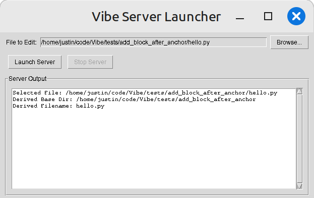
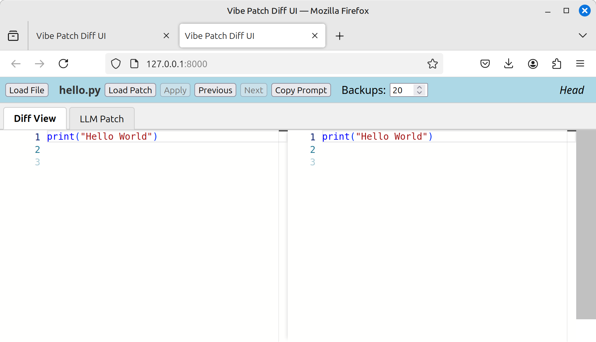
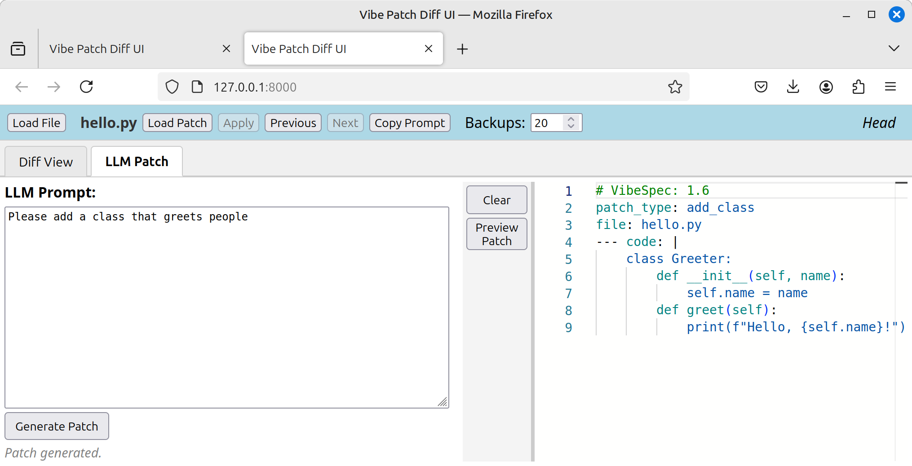
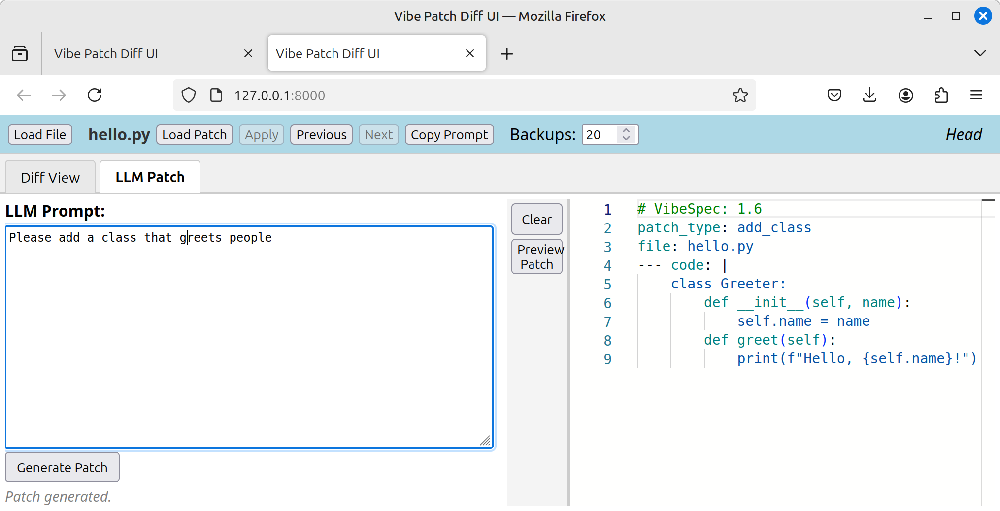
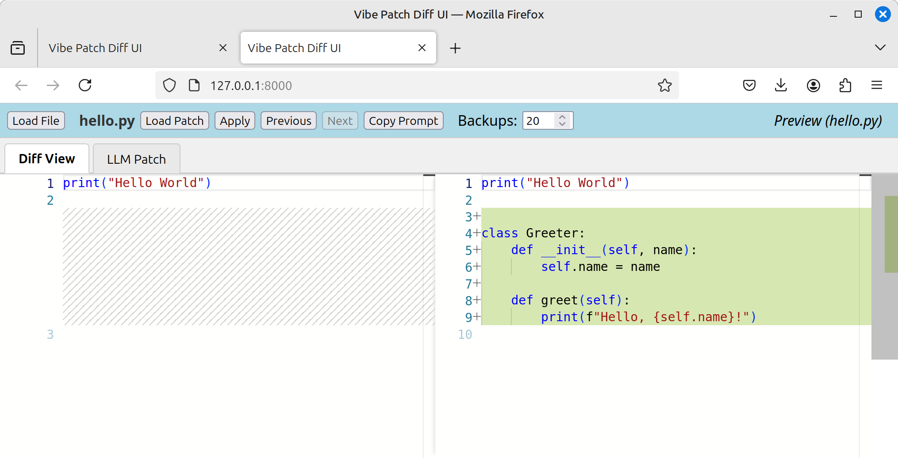
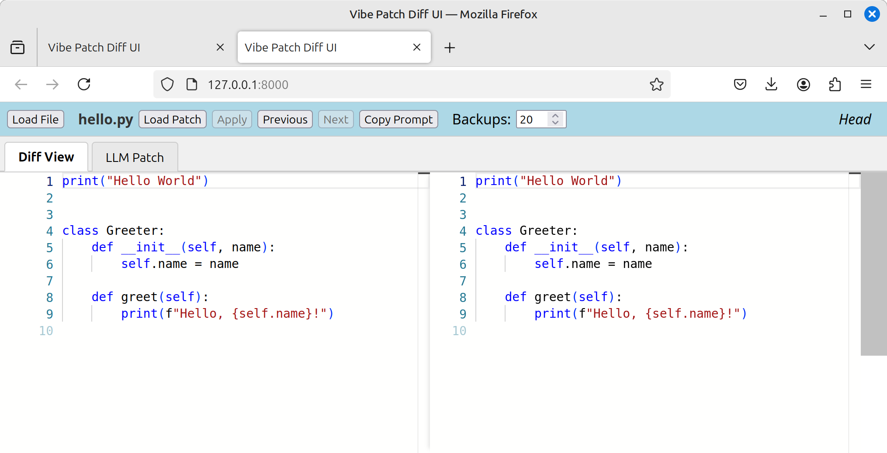

# Interactive Patching Tool

An interactive tool for applying, reviewing, and managing incremental code patches in your projects that also integrates AI-driven patch generation via conversational prompts. Leveraging the Vibe Patches specification, this tool provides a streamlined UI for generating, previewing, and committing code changes.

Coding with AI can be fun, rewarding, and profitable, but it can also be frustrating and time consuming. This tool aims to bridge this gap by providing you with the controls you need to code in confidence, knowing you can revert any changes that break your code, and avoid whitespace issues that plague traditional patch systems.

## Features

- **Apply Vibe Patches**: Seamlessly apply `add_function`, `add_method`, `add_class`, `add_block`, `remove_*`, and `replace_*` patches.
- **Version Navigation**: Browse through patch history with forward and backward controls.
- **Backup Originals**: Automatically back up original files before applying changes.
- **Dry‑Run Mode**: Preview patches without modifying disk files.
- **Diff Viewer**: See side‑by‑side diffs of pending and applied changes.

## Installation

1. Clone the repository:
   ```bash
   conda create -n vibe python=3.12 -y             # [optional]
   conda activate vibe                             # [optional]
   cd ~/code/                                      # use your code directory
   git clone git@github.com:wyojustin/Vibe.git     # clone the repo
   cd Vibe                                        
   ```
2. Install dependencies:
   ```bash
   pip install -r requirements.txt                 # install reqs
   ```
3. Run tests:
   ```bash
   python tests/regression_tester.py               # run the regression tests
   ```
4. Copy example fixtures:
   ```bash
   cp -r tests/multi_patch/ ~/tmp/example/        # save to tmp for testing
   ```
5. Start the UI:
   ```bash
   python server.py --help                         # check out the options
   python server.py --baseDir ~/tmp/example        # launch server
   ```

## Quickstart: Visual Patch Workflow

Below is a step-by-step guide to using the Vibe Patch Diff UI, illustrated with screenshots.

### 1. Launch the Vibe Server

Open a terminal and run:

```bash
python launch_vibe.py
```


Select the Python file you wish to edit, then click Launch Server.

2. Diff View: Load Your File


After browsing and selecting your file, and launching the server, the Diff View will display the current file contents.

3. Switch to LLM Patch Tab


Click the LLM Patch tab to bring up the prompt interface.

4. Enter Your Prompt


Type your desired modification in the prompt box (e.g., “Please add a class that greets people”).

5. Preview the Patch


Click Preview Patch to view the patch preview. The diff view will update to show changes side-by-side.

6. Apply the Patch


Click Apply to accept the changes and update your file. The diff view now shows the new code as applied.

    Tip: Use the Previous and Next buttons to navigate between backups.
    Note: All screenshots are located in Vibe/docs/screenshots/.

## Configuring AI Features (API Keys)

To leverage the AI-driven patch generation capabilities of Vibe, you need to configure your Google Gemini API key. Vibe uses the `python-dotenv` library to load this key from a `.env` file in your project root, making configuration straightforward and secure.

### Setting up your Google Gemini API Key with `.env`

1.  **Obtain a Gemini API Key**:
    *   Visit [Google AI Studio](https://aistudio.google.com/).
    *   You may need to sign in with your Google account and agree to the terms.
    *   Once in AI Studio, click on "**Get API key**" (often found in the left sidebar or by clicking your profile/avatar).
    *   Follow the prompts to create a new API key. Copy this key securely.

2.  **Create a `.env` File**:
    *   In the root directory of your Vibe project (the `Vibe/` directory where `server.py` and `requirements.txt` are located), create a new file named `.env`.
    *   Add your Google Gemini API key to this file. The Vibe server typically expects this key under the environment variable name `GOOGLE_API_KEY`:
        ```env
        GOOGLE_API_KEY="your_google_api_key_here"
        ```
        Replace `"your_google_api_key_here"` with your actual Gemini API key.

3.  **Ensure `.env` is Ignored by Git (Crucial for Security)**:
    *   Your API key is sensitive information and should **never** be committed to version control.
    *   Open your `.gitignore` file (create one in the project root if it doesn't exist) and add the following line:
        ```
        .env
        ```
    *   This will prevent Git from tracking your `.env` file and accidentally exposing your key.

4.  **Launch the Server**:
    *   With the `.env` file in place, `python-dotenv` (assuming it's integrated into `server.py` or a startup script) will automatically load the `GOOGLE_API_KEY` into the environment when the application starts.
    *   Start the Vibe server as usual:
        ```bash
        python launch_vibe.py
        ```
	Browse to the file you'd like to edit, then click "Launch Server"

5.  **Verify Integration**:
    *   Open the Vibe UI in your browser. (if not already opened by Launch Server click)
    *   Navigate to the "LLM Patch" tab.
    *   If the "Generate Patch" button is enabled and there are no error messages like "LLM generation is not available" or "Error checking LLM availability" in the status area below the prompt input, your API key is likely configured correctly and the server is communicating with the Gemini API.

**Important Security Reminders**:
*   Always keep your API keys confidential.
*   The `.env` file method is for local development. For production deployments, use your hosting provider's recommended way to manage secrets (e.g., environment variables set directly on the server, secret management services like Google Cloud Secret Manager).
*   **Double-check that `.env` is listed in your `.gitignore` file before committing any changes.**

If Vibe is configured to use a different environment variable name for the Gemini key, please adjust the `.env` file accordingly.

## (Quick Start for previous version)

1. Open the tool in your browser at `http://localhost:8000`.
2. Click **Load File** and select `hello.py`.
3. Click **Load Patch** and select a `.vibe` file.
4. Preview the diff and click **Accept** to apply changes.
5. Use **Previous** and **Next** buttons to navigate backups.

## AI‑Aided Patch Creation Example

1. In the chat prompt, ask:
   ```text
   Please create a Vibe Patch to add a new class called GrumpyGreater to hello.py
   ```
2. The AI returns a patch spec:
   ```yaml
   # VibeSpec: 1.5
   patch_type: add_class
   file: hello.py
   --- code: |
       class GrumpyGreater:
           """
           A grumpy greeter that begrudgingly greets.
           """
           def __init__(self, name):
               self.name = name

           def greet(self):
               print(f"{self.name}, what do you want?")
   ```
3. Paste this patch into the bottom editor and click **Load Patch** to preview.
4. Click **Accept** to apply the class into `hello.py`.

## Decorator Patch Example

Suppose you want to add a decorated function to your project. Create a `.vibe` file:

```yaml
# VibeSpec: 1.6
patch_type: add_function
file: hello.py
--- code: |
    @log_enter_exit
    @timer()
    def greet(name):
        print(f"Greetings, {name}!")
```

Then apply it via CLI or UI:

```bash
# Preview the patch (dry‑run)
python vibe_cli.py preview decorator_patch.vibe

# Apply the patch
python vibe_cli.py apply decorator_patch.vibe
```

After applying, `hello.py` will include:

```python
@log_enter_exit
@timer()
def greet(name):
    print(f"Greetings, {name}!")
```

## License

This project is licensed under the MIT License. See [LICENSE](LICENSE) for details.

