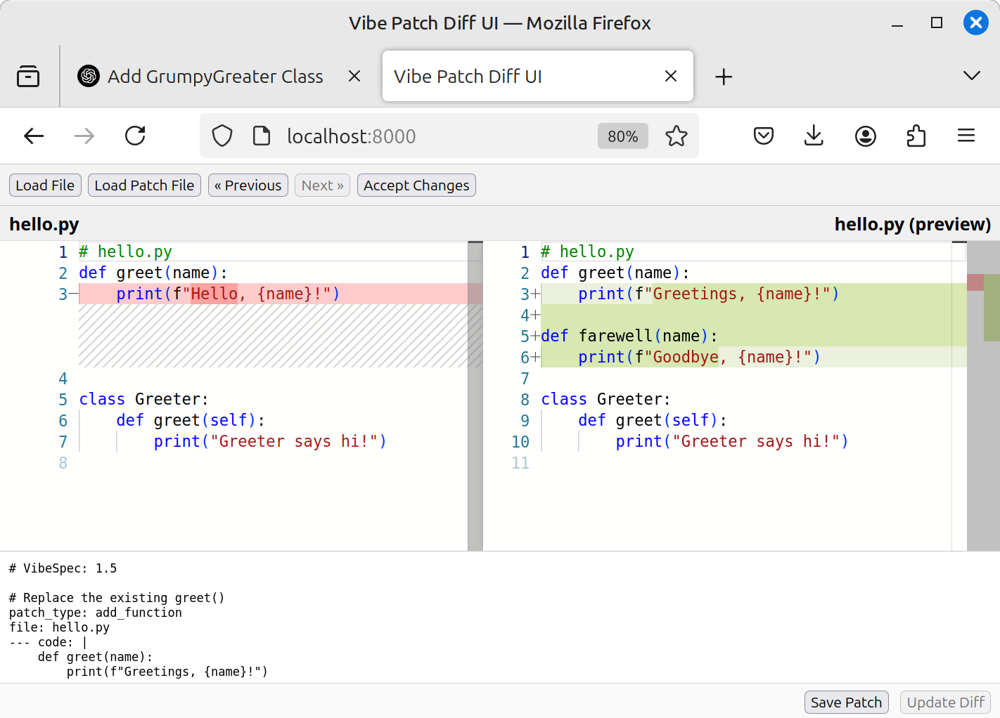

# Interactive Patching Tool

An interactive tool for applying, reviewing, and managing incremental code patches in your projects that also integrates AI-driven patch generation via conversational prompts. Leveraging the Vibe Patches specification, this tool provides a streamlined UI for generating, previewing, and committing code changes.

## Features

- **Apply Vibe Patches**: Seamlessly apply `add_function`, `add_method`, `add_class`, and `add_block` patches to your source files.
- **Version Navigation**: Browse through patch history with forward and backward controls.
- **Backup Originals**: Automatically back up original files before applying changes.
- **Dry-Run Mode**: Preview patches without modifying disk files.
- **Diff Viewer**: See side-by-side diffs of pending and applied changes.

## Installation

1. Clone the repository:
   ```bash
    conda create -n vibe python=3.12 -y             # [optional]
    conda activate vibe                             # [optional]
    cd ~/code/                                      # use your code directory
    git clone git@github.com:wyojustin/Vibe.git     # clone the repo
    cd Vibe                                            
   ```
2. Install dependencies:
   ```bash
    pip install -r requirements.txt                 # install reqs
   ```
3. Run tests
   ```bash
    python tests/regression_tester.py               # run the regression tests
   ```
4. Copy example
   ```bash
   cp -r tests/multi_patch/ ~/tmp/example/        # save to tmp for testing
   ```
5. Start the UI:
   ```bash
    python server.py --help                         # check out the options
    python server.py --baseDir ~/tmp/example        # launch server
   ```

## Quick Start

1. Open the tool in your browser at `http://localhost:8000`.
2. Load a target file or directory. (~/tmp/example/hello.py)
3. Create or load a Vibe Patch YAML file. (~/tmp/example/multi_patch.vibe)
4. Preview the diff and click **Apply Changes**.
5. Navigate through backups using the **Previous** and **Next** buttons.

## AI-Aided Patch Creation Example

1. In the chat prompt, ask:
   ```text
   Please review the system-prompt and create a Vibe Patch to add a new class called GrumpyGreater to hello.py
   ```
   
2. The AI returns a patch spec:
   ```yaml
   # VibeSpec: 1.5
   patch_type: add_class
   file: hello.py
   --- code: |
       class GrumpyGreater:
           """
           A grumpy greeter that begrudgingly greets.
           """
           def __init__(self, name):
               self.name = name

           def greet(self):
               print(f"{self.name}, what do you want?")
   ```
   
3. Paste this patch into the bottom editor and click **Update Diff** to preview:

   
4. Click **Accept Changes** to apply the class into `hello.py`:

## Example

To try a multi-patch workflow:

1. Copy the `tests/multi_patch` directory to a temporary location:

   ```bash
   cp -r tests/multi_patch /tmp/example
   ```

2. Launch the server pointing at your temp directory:

   ```bash
   python run_server.py --baseDir /tmp/example
   ```

   

3. In your browser, upload `hello.py` and then the patch bundle `multi_patch.vibe`:

   

4. Review the proposed changes in the diff viewer and click **Apply Changes**:

   

5. After applying, inspect the updated preview:

   

6. Use the **Previous** button to revert to the prior version if desired:

   

## Usage

Detailed usage examples and command-line options will be added here.

## Contributing

Contributions welcome! Please read [CONTRIBUTING.md](CONTRIBUTING.md) for guidelines.

## License

This project is licensed under the MIT License. See [LICENSE](LICENSE) for details.

