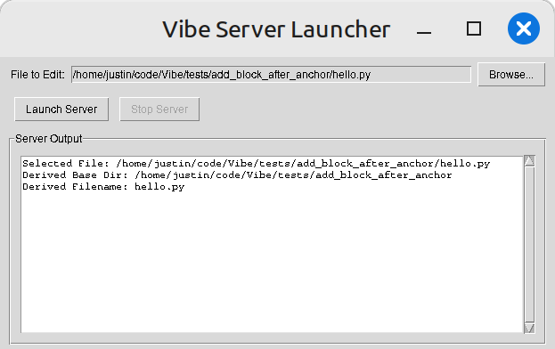

# Vibe Quickstart Guide

This guide provides a quick visual walkthrough of the core Vibe workflow: launching the UI, generating a patch with AI, and applying it.

**Goal:** Add a new `GrumpyGreeter` class to `hello.py`.

**1. Launch Vibe Server**

*   Run the Tkinter launcher script: `python launch_vibe.py`
*   Click "Browse..." and select the target Python file (e.g., `hello.py`).
*   Click "Launch Server". This starts the backend server and automatically opens the Vibe UI in your default web browser.

    

**2. Generate Patch with AI (e.g., ChatGPT)**

*   Copy the contents of `system-prompt.md` (you can use the "Copy Prompt" button in the Vibe UI later, but for the first time, copy it manually).
*   Copy the code from your target file (`hello.py`).
*   Go to your preferred AI Chat interface (like ChatGPT).
*   Paste the system prompt first.
*   Upload or paste the `hello.py` code.
*   Provide your request, referencing the prompt and code: "Please review the system-prompt and create a Vibe Patch to add a new class called GrumpyGreeter to hello.py".

    

*   The AI should generate a Vibe Patch in the correct YAML format. Copy the generated YAML code block.

    

    *(Alternatively, you can use tools like Google AI Studio with the same system prompt and code.)*
    

**3. Preview the Patch in Vibe UI**

*   Go back to the Vibe Diff UI tab in your browser (it should have loaded `hello.py`).
*   Paste the copied Vibe Patch YAML into the bottom-left "Patch Editor" pane.
*   Click the **"Preview Patch"** button located just above the patch editor.
*   The right-hand pane of the diff view will update to show a preview of `hello.py` *with the patch applied*. You can see the differences highlighted.

    

**4. Apply the Changes**

*   Review the diff preview in the right pane.
*   If the changes look correct, click the **"Apply"** button in the main **toolbar** at the top.
*   This action saves the changes from the right pane to your original `hello.py` file (after creating a backup) and refreshes the UI to show the new file content in both panes.

**Congratulations!** You have successfully used Vibe and AI to modify your code. You can now generate another patch or explore the version history using the "Previous" / "Next" buttons.